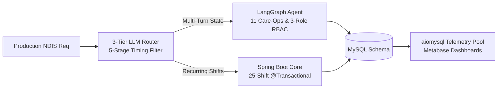
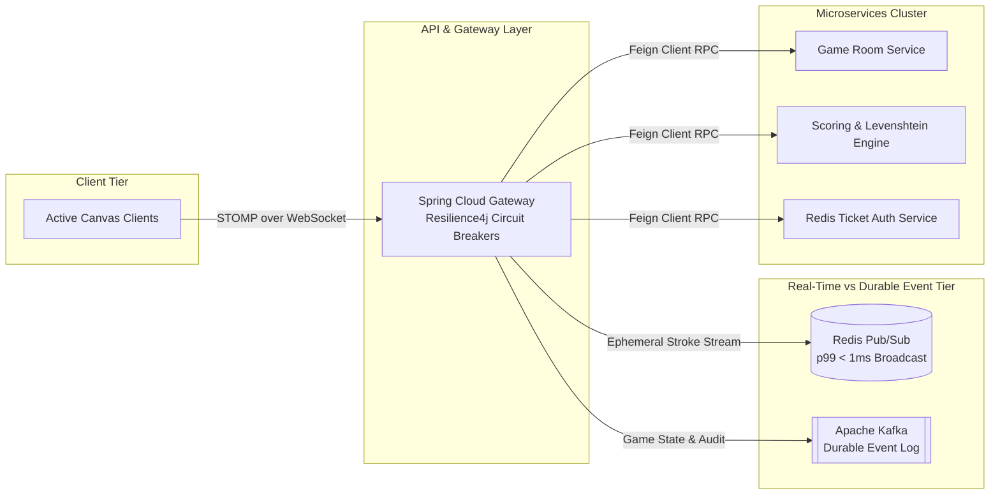
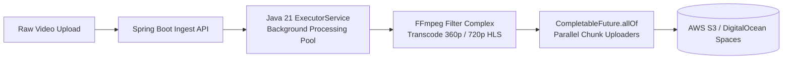

# Santrupt Potphode

### **Backend Developer**
*Architecting high-throughput distributed microservices, low-latency streaming, and resilient event-driven systems.*

[Interactive Portfolio (3D/Retro)](https://santrupt.dev) · [LinkedIn](https://linkedin.com/in/santrupt29) · [Email](mailto:santrupt.potphode29@gmail.com) · [X / Twitter](https://x.com/santrupt_29)

<br/>

| Target Latency | Event Bus | Agentic Workflows | Problem Solving |
| :--- | :--- | :--- | :--- |
| `p99 < 1ms` (STOMP/Redis) | `Kafka + Redis PubSub` | `11 Care-Ops (LangGraph)` | `600+ LeetCode (Top 15%)` |

---

## 💼 Production Experience

### **Software Development Engineer Intern** · [Swastik Software Technologies]
*May 2026 – July 2026 · Mumbai, India*  
`Java · Spring Boot · Python · LangGraph · MySQL · aiomysql · Metabase · RBAC`



<details open>
<summary><b>Key Architectural Deliverables</b></summary>

- **LangGraph Multi-Turn Agent**: Orchestrated stateful AI workflow coordinator supporting 11 distinct care-operations workflows, strict multi-turn state checkpointing, and 3-role granular RBAC for a production NDIS platform.
- **Latency Optimization (60s+ → <1s)**: Engineered a 3-tier LLM routing pipeline with 5-stage timing instrumentation, eliminating cold-call latency that previously triggered production 502 gateway timeouts.
- **Transactional Batch Scheduling**: Extended Spring Boot to handle recurring shift series utilizing 25-occurrence `@Transactional` atomic batch execution; bridged asynchronous Python NLP worker processes.
- **Cross-Service Observability Pipeline**: Designed a 5-table normalized MySQL schema capturing distributed trace events across Java and Python runtimes, integrated with `aiomysql` connection pooling and real-time Metabase dashboards.
</details>

---

## 🚀 Distributed Systems & Featured Projects

### 1. [Doodle-Sync](https://github.com/santrupt29/Doodle-Sync) — Real-Time Multiplayer Canvas & Game Engine
`Spring Boot 3.5 · Spring Cloud Gateway · Apache Kafka · Redis · WebSocket/STOMP · Docker`  
[Live Demo Video](https://drive.google.com/file/d/1T3MsEo3LxXi6Gzky-4QpUbwg6AkAsaOq/view) · [Source Code](https://github.com/santrupt29/Doodle-Sync)



<details>
<summary><b>Architectural Invariants & Design Decisions</b></summary>

- **Hybrid Streaming Model**: Segregated ephemeral stroke data from durable game state. Real-time draw events stream through Redis Pub/Sub to maintain `p99 < 1ms` broadcast latency, reserving Kafka topics strictly for durable state persistence and recovery.
- **Fault-Tolerant Microservices**: Deployed 7 decoupled microservices behind a unified Spring Cloud Gateway using Resilience4j circuit breakers and Feign clients with automatic fallback degradation.
- **State Machine & Guess Detection**: Implemented a 5-state deterministic game cycle with dynamic time-decay scoring algorithms and Levenshtein-distance fuzzy matching to detect near-miss guesses in real-time.
- **Secure Ephemeral Ticketing**: Mitigated WebSocket authentication overhead by engineering a Redis-backed 30-second TTL single-use ticketing handshake bridging standard JWT stateless authentication.
</details>

---

### 2. [Vortex](https://github.com/santrupt29/stream-spring-backend) — Distributed Asynchronous Video Streaming Pipeline
`Java 21 · Spring Boot 3.5 · PostgreSQL · AWS S3 / DO Spaces · FFmpeg · Next.js`  
[Live Deployment](https://vortexhq.vercel.app) · [Backend Source](https://github.com/santrupt29/stream-spring-backend)



<details>
<summary><b>Architectural Invariants & Concurrency Design</b></summary>

- **Asynchronous Transcoding Pipeline**: Decoupled HTTP upload ingress from video processing via dedicated Java 21 `ExecutorService` thread pools, completely eliminating client timeout drops during CPU-intensive transcoding.
- **Adaptive Bitrate Streaming (ABR)**: Constructed FFmpeg multi-output filter pipelines generating master `.m3u8` playlists and multi-resolution (360p / 720p) `.ts` chunk variants for dynamic network-adaptive switching.
- **Non-Blocking S3 Upload Acceleration**: Parallelized multi-part chunk uploads utilizing Java's `CompletableFuture.allOf()`, reducing post-transcode artifact upload time from 120s down to 20s (**83% latency reduction**).
- **Zero-OOM Memory Governance**: Configured DigitalOcean Linux droplets with targeted swap space and tuned PostgreSQL HikariCP connection pooling, eliminating 100% of out-of-memory worker crashes during concurrent rendering.
</details>

---

### 3. [HireLyze](https://github.com/santrupt29/ai-resume-screener) — High-Throughput AI Resume Screener SaaS
`React.js · Express.js · Supabase · Google GenAI · Redis`  
[Live Deployment](https://hirelyzehq.vercel.app) · [Source Code](https://github.com/santrupt29/ai-resume-screener)

- **Semantic Screening Pipeline**: Orchestrated Google GenAI embeddings pipeline processing 1,000+ candidate resumes with 90%+ job description semantic alignment.
- **Caching Layer**: Built a Redis-cached document parsing layer for multi-format inputs (PDF/DOCX), cutting repeated analysis turnaround time by 3x.
- **High-Availability Data Layer**: Designed serverless REST APIs over Supabase PostgreSQL with role-based access control, maintaining 99.9% uptime.

---

## 🛠 System Architecture & Tooling

```text
┌─────────────────────────┬──────────────────────────────────────────────────────────┐
│ LAYER                   │ TECHNOLOGIES                                             │
├─────────────────────────┼──────────────────────────────────────────────────────────┤
│ Runtimes & Languages    │ Java (21), C++, Python, JavaScript, TypeScript, SQL      │
│ Frameworks & Backend    │ Spring Boot 3.5, Spring Cloud, Node.js, Express          │
│ Distributed Messaging   │ Apache Kafka, Redis (Pub/Sub & Caching), WebSocket/STOMP │
│ Agentic AI & LLMs       │ LangGraph, Multi-Agent Workflows, LLM Routing, GenAI     │
│ Storage & Persistence   │ PostgreSQL, MySQL, MongoDB, Supabase                     │
│ Cloud, Infra & Media    │ Docker, AWS S3, DigitalOcean, FFmpeg, GitHub Actions     │
│ Observability & Metrics │ Prometheus, Grafana, Zipkin, Metabase                    │
└─────────────────────────┴──────────────────────────────────────────────────────────┘
```

---

## 🏆 Algorithmic Thinking & Competitive Programming

- **LeetCode**: **600+** Problems Solved · Peak Rating **1687** (Top 15% Globally)
- **CodeChef**: **3★** Competitive Coder · Peak Rating **1608** (Top 25%)
- **Codeforces**: **Pupil** · 200+ Problems Solved · Peak Rating **1275**
- **Community Leadership**: Core Member, Competitive Programming (CP) Club & Mentor at Community of Coders (COC), VJTI

---

## 📊 Live GitHub Telemetry

<div align="center">
  
  
  <br/>
  
</div>

---

<div align="center">
  <sub>Engineered by Santrupt Potphode · VJTI Mumbai ('27) · <a href="https://santrupt29.vercel.app">Explore 3D Retro Portfolio →</a></sub>
</div>
